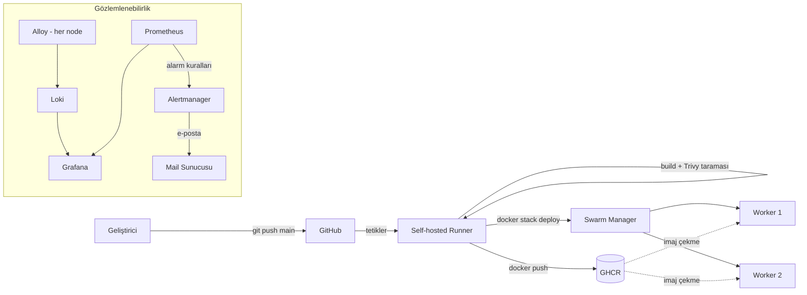

# 🚀 Docker Swarm & CI/CD Zero-Downtime Deployment Lab

Bu proje, modern DevOps süreçlerini, yüksek erişilebilirlik (High Availability) prensiplerini ve CI/CD otomasyonunu pratik etmek amacıyla Rocky Linux üzerinde kurguladığım 3 node'lu bir Docker Swarm laboratuvar ortamıdır.

Amacım; kodun GitHub deposuna gönderilmesinden (push) canlı sunucularda kesintisiz (zero-downtime) ayağa kalkmasına kadar olan tüm süreci insan müdahalesi olmadan otomatize etmek ve ortamı metrik, log ve alarm katmanlarıyla izlenebilir hale getirmektir.

**Öne çıkanlar**

- Her `push` ile otomatik build, güvenlik taraması ve deploy
- `start-first` rolling update ve sağlık kontrolü ile kesintisiz güncelleme, hatalı sürümde otomatik rollback
- Her imaj commit SHA ile etiketlenir, hangi sürümün canlıda olduğu izlenebilir
- Prometheus + Grafana (metrik), Loki + Alloy (log), Alertmanager (e-posta alarmı)
- Portainer ile merkezi yönetim

## 🛠️ Kullanılan Teknolojiler (Tech Stack)

| Katman | Teknoloji |
|---|---|
| **İşletim Sistemi** | Rocky Linux (1 Manager, 2 Worker) |
| **Orkestrasyon** | Docker Swarm (stack dosyası ile) |
| **CI/CD** | GitHub Actions (Self-hosted runner) |
| **Konteyner Registry** | GitHub Container Registry (GHCR) |
| **İmaj Güvenlik Taraması** | Trivy |
| **Metrik İzleme** | Prometheus, Node Exporter, Grafana |
| **Loglama** | Loki, Grafana Alloy |
| **Alarm** | Alertmanager (e-posta bildirimi) |
| **Gizli Bilgi Yönetimi** | Docker Secrets |
| **Yönetim Arayüzü** | Portainer |

---

## 🏗️ 1. Altyapı ve Cluster Mimarisi

Sistem, 3 adet Rocky Linux sunucusundan oluşmaktadır. Tüm düğümler (nodes) aktif olarak trafiği karşılamaktadır.

---

## 🔄 2. CI/CD Pipeline ve Kesintisiz Dağıtım

Yazılımın canlı ortama alınması tamamen GitHub Actions üzerinden kurgulanmıştır.
Geliştirici kodu `main` dalına (branch) gönderdiğinde pipeline otomatik olarak tetiklenir:

1. Repo çekilir ve Docker imajı **commit SHA** ve `latest` etiketleriyle derlenir.
2. İmaj **Trivy** ile taranır, kritik ve düzeltilebilir bir açık varsa pipeline durur.
3. İmaj **GHCR**'a (GitHub Container Registry) yüklenir.
4. Self-hosted runner, Swarm cluster'ına `docker stack deploy` ile yeni sürümü uygular (Rolling Update).
5. Smoke test uygulanır. Servis ayağa kalkmazsa **otomatik rollback** yapılır.

**Kesintisiz güncelleme için kullanılan ayarlar**

- `order: start-first`: Yeni container sağlıklı hale gelmeden eskisi kapatılmaz.
- `healthcheck`: Swarm trafiği yalnızca sağlıklı container'lara yönlendirir.
- `parallelism: 1`: Replica'lar tek tek güncellenir.
- `failure_action: rollback`: Başarısız güncelleme otomatik geri alınır.

**Yapılandırma dosyaları:** [`.github/workflows/deploy.yml`](.github/workflows/deploy.yml) (pipeline) ve [`stack.yml`](stack.yml) (Swarm servis tanımı).

### Başarılı Pipeline Geçmişi

---

## 📊 3. Monitoring, Loglama ve Alarm

Sistemi üç katmanda izliyorum: **metrik** (ne oluyor), **log** (neden oluyor) ve **alarm** (biri bakmadan haberdar olma).

Aşağıdaki CLI çıktısında görüldüğü üzere; web uygulaması 2 replica ile yük dengelemesi (load balancing) yaparak çalışırken, Node Exporter metrik toplamak için "global" modda her sunucuya (3/3) otomatik olarak dağıtılmıştır.

### Portainer ile Merkezi Yönetim

Servislerin sağlığını, loglarını ve replica durumlarını anlık izlemek için Portainer kullanılmaktadır.

### Grafana & Prometheus ile Metrik İzleme

CPU, RAM, Network ve Disk kullanımları Node Exporter ile toplanır, Prometheus'ta saklanır ve Grafana dashboard'unda görselleştirilir.

### Loki & Alloy ile Merkezi Loglama

Container logları her node'da çalışan **Grafana Alloy** ajanı tarafından toplanıp **Loki**'ye gönderilir. Bir container hangi node'da çalışırsa çalışsın, logları Grafana'daki **Explore** ekranından tek yerden incelenebilir.

> Not: Promtail, Grafana tarafından 2 Mart 2026'da kullanımdan kaldırıldığı için log ajanı olarak Alloy tercih edilmiştir.

### Alertmanager ile Alarm

Prometheus'taki alarm kuralları tetiklendiğinde **Alertmanager** bildirimi e-posta ile gönderir. SMTP kimlik bilgisi yapılandırma dosyasında düz metin olarak durmaz, **Docker secret** olarak tanımlanmıştır.

---

## 🔒 4. Ağ ve Güvenlik

- **En az yetki ilkesi:** Workflow izinleri yalnızca `contents: read` ve `packages: write` ile sınırlıdır.
- **Gizli bilgi yönetimi:** Registry girişi için geçici `GITHUB_TOKEN` kullanılır, repoda sabit şifre yoktur. Mail sunucusu şifresi Docker secret olarak saklanır.
- **İmaj taraması:** Her build Trivy ile taranır.
- **Kaynak sınırları:** Servisler için CPU ve bellek limitleri tanımlıdır.
- **Firewall:** Sunucularda `firewalld` aktiftir. Swarm için gereken portlar açıktır: `2377/tcp` (cluster yönetimi), `7946/tcp+udp` (node'lar arası iletişim) ve `4789/udp` (overlay ağ trafiği).

---

## 🧭 5. Bilinen Sınırlamalar

Bu bir laboratuvar ortamıdır ve bilinçli olarak kabul edilen sınırlamaları vardır:

- **Tek manager node:** Manager düşerse çalışan servisler devam eder, ancak cluster yönetilemez ve yeni deploy yapılamaz.
- **Tek self-hosted runner:** Runner düşerse pipeline çalışmaz.

---

*Bu laboratuvar ortamı, modern DevOps süreçlerini pratik etmek amacıyla hazırlanmıştır.*
